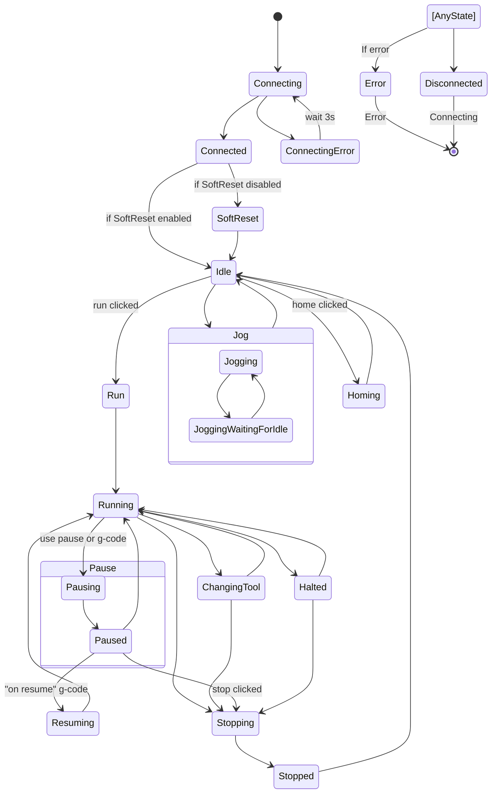

G-Pilot (formerly Candle)
-----------

What G stands for?

- G-code Pilot: G-code is a programming language used to control CNC machines, so "G-Pilot" may suggest that the program is used for piloting or controlling using G-code.
- Guided Pilot: "G-Pilot" may also suggest that the program provides guidance or leads the user through processes related to CNC machining, similar to how a pilot guides an airplane.
- Global Pilot: This may suggest that the program offers solutions on a global scale, able to handle various types of CNC machines and be a versatile tool for controlling them.
- Genius Pilot: "G-Pilot" may suggest that the program is smart or advanced, similar to a pilot with high piloting skills.
- Graphical Pilot: If the program offers a graphical interface for controlling CNC machines, the name "G-Pilot" may suggest that it is a graphics-based tool.

*This fork is based on the Candle `experimental` branch. The main goal is to add joystick/joypad support. Other than that, I'm making improvements/bugfixes at my discretion.*

*Any help is welcome!*

What is G-Pilot?
-----------

GRBL/uCNC controller application with G-Code visualizer written in Qt.

Supported functions:
* Controlling GRBL-based cnc-machine via console commands, buttons on form, numpad.
* Monitoring cnc-machine state.
* Loading, editing, saving and sending of G-code files to cnc-machine.
* Visualizing G-code files.
* Joystick/Joypad/Controller support.
* Customizable interface.
* uCNC virtual mode (cnc machine simulator).

System requirements for running "G-Pilot":
-------------------
* Windows 10/Linux x86(not tested att all!)
* Graphics card with OpenGL 3.0 support
* 120 MB free storage space

Usefull links:

* https://github.com/Paciente8159/uCNC (modern firmware, inspired by Grbl and LinuxCNC)
* https://github.com/grbl/grbl (original GRBL firmware)
* https://github.com/grblHAL (modular, mostly compatible with GRBL)

Build requirements:
-------------------
Qt 6.8 with MinGW/GCC 64bit compiler

Start with:

git clone --recurse-submodules https://github.com/etet100/G-Pilot-Formerly-Candle

Connection modes:
-----------------

G-Pilot supports the following connection modes:
* Serial port
* Raw TCP, uses exactly the same protocol as serial port mode, no additional handshaking is performed
* uCNC virtual mode, no real hardware needed

Architecture:
-------------

The original Candle was built in a way that was not transparent and difficult to modify. My version will be built modularly, in a way that is tentatively presented in the diagram below. One of the changes is the complete separation of the interface from the machine control logic. This has the following advantages:

* General transparency and manageability of the code
* The ability to quickly change the UI, even with the possibility of creating it in a * different technology
* Easier handling of new communication methods
* Much easier addition of new features
* Easier testing

Application states:
-------------------

The diagram below shows the possible states of the application. Transitions between states are triggered by events such as changing the state of the machine, clicking buttons, etc.

Configurations:
---------------

Another module begging for a rewrite is the configuration storage mechanism. Of course, it will be detached into a separate module. Settings sets will be wrapped in separate classes. The reading and writing of fields will be partially automated. Persistence layer will be separated from the configuration logic. The configuration will be stored in a local file or in a cloud, for example Dropbox or Google Drive.

Downloads:
----------
Only Windows preview version is available at the moment. They are not stable and contain many critical bugs. The Linux version will be available sooner or later.

How it looks:
-------------

Main window:

Settings:

GRBL configurator:

